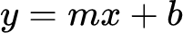
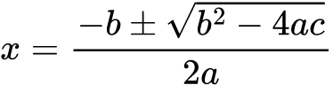
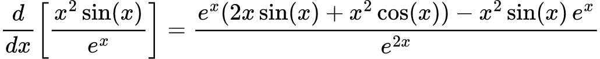
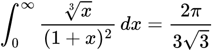
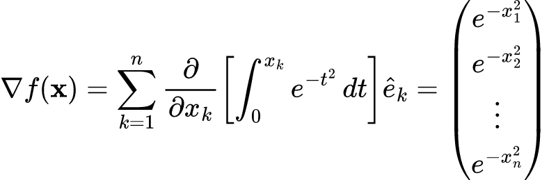

<p align="center">
  
</p>

<p align="center">
  Generate SVGs and PNGs of mathematical expressions using <a href="https://www.mathjax.org/">MathJax</a>
</p>

<p align="center">
  <a href="https://hex.pm/packages/math_jax">
    
  </a>

  <a href="https://github.com/akoutmos/math_jax/actions">
    
  </a>

  <a href="https://coveralls.io/github/akoutmos/math_jax?branch=master">
    
  </a>

  <a href="https://github.com/sponsors/akoutmos">
    
  </a>
</p>

<br>

# Contents

- [Installation](#installation)
- [Example Output](#example-output)
- [Supporting MathJax](#supporting-sqlfmt)
- [Attribution](#attribution)

## Installation

[Available in Hex](https://hex.pm/packages/math_jax), the package can be installed by adding `math_jax` to your list of
dependencies in `mix.exs`:

```elixir
def deps do
  [
    {:math_jax, "~> 0.1.0"}
  ]
end
```

Documentation can be found at [https://hexdocs.pm/math_jax](https://hexdocs.pm/math_jax).

## Example Output

After setting up MathJax in your application you can use the MathJax functions in order to generate images of
mathematical expressions:

### Example 1

```elixir
MathJax.render!(~S"y = mx + b", :png)
```

<p align="center">
  
</p>

### Example 2

```elixir
MathJax.render!(~S"x = \frac{-b \pm \sqrt{b^2 - 4ac}}{2a}", :png)
```

<p align="center">
  
</p>

### Example 3

```elixir
MathJax.render!(~S"\frac{d}{dx}\left[\frac{x^2 \sin(x)}{e^x}\right] = \frac{e^x(2x\sin(x) + x^2\cos(x)) - x^2\sin(x)\,e^x}{e^{2x}}", :png)
```

<p align="center">
  
</p>

### Example 4

```elixir
MathJax.render!(~S"\int_{0}^{\infty} \frac{\sqrt[3]{x}}{(1+x)^2} \, dx = \frac{2\pi}{3\sqrt{3}}", :png)
```

<p align="center">
  
</p>

### Example 5

```elixir
MathJax.render!(~S"\nabla f(\mathbf{x}) = \sum_{k=1}^{n} \frac{\partial}{\partial x_k} \left[ \int_{0}^{x_k} e^{-t^2} \, dt \right] \hat{e}_k = \begin{pmatrix} e^{-x_1^2} \\ e^{-x_2^2} \\ \vdots \\ e^{-x_n^2} \end{pmatrix}", :png)
```

<p align="center">
  
</p>

## Supporting MathJax

If you rely on this library help you debug your Ecto/SQL queries, it would much appreciated if you can give back
to the project in order to help ensure its continued development.

Checkout my [GitHub Sponsorship page](https://github.com/sponsors/akoutmos) if you want to help out!

### Gold Sponsors

<a href="https://github.com/sponsors/akoutmos/sponsorships?sponsor=akoutmos&tier_id=58083">
  
</a>

### Silver Sponsors

<a href="https://github.com/sponsors/akoutmos/sponsorships?sponsor=akoutmos&tier_id=58082">
  
</a>

### Bronze Sponsors

<a href="https://github.com/sponsors/akoutmos/sponsorships?sponsor=akoutmos&tier_id=17615">
  
</a>

## Attribution

- The MathJax library leans on the Rust library [mathjax_svg](https://github.com/gw31415/mathjax_svg) for compiling MathJax expressions.
